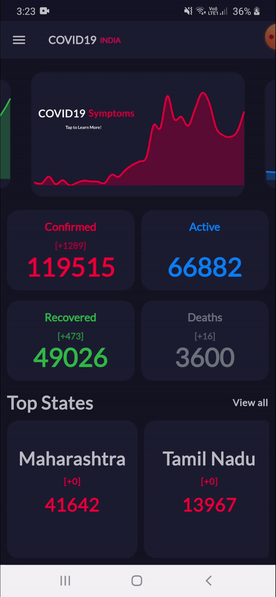
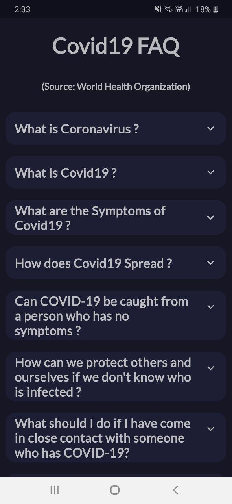

# COVID19 India

COVID19 India is a flutter project that tracks COVID19 Stats in India.
NOTE : Every data in this app is collected from covid19india.org API.

### Download

Link 1 (Fastest) : https://firebasestorage.googleapis.com/v0/b/covid19-india-6c4da.appspot.com/o/COVID19India.apk?alt=media&token=d9167e3d-b805-4622-b135-6df3e973a378

Link 2 : https://drive.google.com/open?id=1pvO2wKRIS5fLxuLiqiuq8Rld5ezSkmzQ

Link 3 (Slow) : http://www.mediafire.com/file/2556fm9hbfyy1me/COVID19India.apk/file

## Home

## ViewAll Screen

## Interactive State Screen

## COVID19 FAQs (source : WHO )

## Cards

